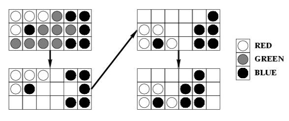

# The Same Game

Time Limit: 1000MS

Memory Limit: 10000K


## Description

The game named "Same" is a single person game played on a 10 \Theta 15 board. Each square contains a ball colored red (R), green (G), or blue (B). Two balls belong to the same cluster if they have the same color, and one can be reached from another by following balls of the same color in the four directions up, down, left, and right. At each step of the game, the player chooses a ball whose cluster has at least two balls and removes all balls in the cluster from the board. Then, the board is "compressed" in two steps:

1. Shift the remaining balls in each column down to fill the empty spaces. The order of the balls in each column is preserved.

2. If a column becomes empty, shift the remaining columns to the left as far as possible. The order of the columns is preserved.

For example, choosing the ball at the bottom left corner in the sub-board below causes:



The objective of the game is to remove every ball from the board, and the game is over when every ball is removed or when every cluster has only one ball. The scoring of each game is as follows. The player starts with a score of 0. When a cluster of m balls is removed, the player's score increases by (m-2)^2 . A bonus of 1000 is given if every ball is removed at the end of the game.

You suspect that a good strategy might be to choose the ball that gives the largest possible cluster at each step, and you want to test this strategy by writing a program to simulate games played using this strategy. If there are two or more balls to choose from, the program should choose the leftmost ball giving the largest cluster. If there is still a tie, it should choose the bottommost ball of these leftmost balls.


## Input

You will be given a number of games in the input. The first line of input contains a positive integer giving the number of games to follow. The initial arrangement of the balls of each game is given one row at a time, from top to bottom. Each row contains 15 characters, each of which is one of "R", "G", or "B", specifying the colors of the balls in the row from left to right. A blank line precedes each game.


## Output

For each game, print the game number, followed by a new line, followed by information about each move, followed by the final score. Each move should be printed in the format:

Move x at (r,c): removed b balls of color C, got s points.

where x is the move number, r and c are the row number and column number of the chosen ball, respectively. The rows are numbered from 1 to 10 from the bottom, and columns are numbered from 1 to 15 from the left. b is the number of balls in the cluster removed. C is one of "R", "G", or "B", indicating the color of the balls removed. s is the score for this move. The score does not include the 1000 point bonus if all the balls are removed after the move.

The final score should be reported as follows:

Final score: s, with b balls remaining.

Insert a blank line between the output of each game. Use the plural forms "balls" and "points" even if the corresponding value is 1.


## Sample Input

```
3
RGGBBGGRBRRGGBG
RBGRBGRBGRBGRBG
RRRRGBBBRGGRBBB
GGRGBGGBRRGGGBG
GBGGRRRRRBGGRRR
BBBBBBBBBBBBBBB
BBBBBBBBBBBBBBB
RRRRRRRRRRRRRRR
RRRRRRGGGGRRRRR
GGGGGGGGGGGGGGG

RRRRRRRRRRRRRRR
RRRRRRRRRRRRRRR
GGGGGGGGGGGGGGG
GGGGGGGGGGGGGGG
BBBBBBBBBBBBBBB
BBBBBBBBBBBBBBB
RRRRRRRRRRRRRRR
RRRRRRRRRRRRRRR
GGGGGGGGGGGGGGG
GGGGGGGGGGGGGGG

RBGRBGRBGRBGRBG
BGRBGRBGRBGRBGR
GRBGRBGRBGRBGRB
RBGRBGRBGRBGRBG
BGRBGRBGRBGRBGR
GRBGRBGRBGRBGRB
RBGRBGRBGRBGRBG
BGRBGRBGRBGRBGR
GRBGRBGRBGRBGRB
RBGRBGRBGRBGRBG
```


## Sample Output

```
Game 1:

Move 1 at (4,1): removed 32 balls of color B, got 900 points.
Move 2 at (2,1): removed 39 balls of color R, got 1369 points.
Move 3 at (1,1): removed 37 balls of color G, got 1225 points.
Move 4 at (3,4): removed 11 balls of color B, got 81 points.
Move 5 at (1,1): removed 8 balls of color R, got 36 points.
Move 6 at (2,1): removed 6 balls of color G, got 16 points.
Move 7 at (1,6): removed 6 balls of color B, got 16 points.
Move 8 at (1,2): removed 5 balls of color R, got 9 points.
Move 9 at (1,2): removed 5 balls of color G, got 9 points.
Final score: 3661, with 1 balls remaining.

Game 2:

Move 1 at (1,1): removed 30 balls of color G, got 784 points.
Move 2 at (1,1): removed 30 balls of color R, got 784 points.
Move 3 at (1,1): removed 30 balls of color B, got 784 points.
Move 4 at (1,1): removed 30 balls of color G, got 784 points.
Move 5 at (1,1): removed 30 balls of color R, got 784 points.
Final score: 4920, with 0 balls remaining.

Game 3:

Final score: 0, with 150 balls remaining.
```


## Source

East Central North America 1999
