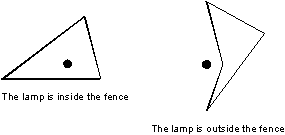

# Fence

Time Limit: 1000MS

Memory Limit: 10000K


## Description

There is an area bounded by a fence on some flat field. The fence has the height h and in the plane projection it has a form of a closed polygonal line (without self-intersections), which is specified by Cartesian coordinates (Xi, Yi) of its N vertices. At the point with coordinates (0, 0) a lamp stands on the field. The lamp may be located either outside or inside the fence, but not on its side as it is shown in the following sample pictures (parts shown in a thin line are not illuminated by the lamp):



The fence is perfectly black, i.e. it is neither reflecting, nor diffusing, nor letting the light through. Research and experiments showed that the following law expresses the intensity of light falling on an arbitrary illuminated point of this fence:

I_0 = k / r

where k is a known constant value not depending on the point in question, r is the distance between this point and the lamp in the plane projection. The illumination of an infinitesimal narrow vertical board with the width dl and the height h is

dI = I_0 * |cos α| * dl * h

where I_0 is the intensity of light on that board of the fence, α is the angle in the plane projection between the normal to the side of the fence at this point and the direction to the lamp.

You are to write a program that will find the total illumination of the fence that is defined as the sum of illuminations of all its illuminated boards.


## Input

The first line of the input file contains the numbers k, h and N, separated by spaces. k and h are real constants. N (3 <= N <= 100) is the number of vertices of the fence. Then N lines follow, every line contains two real numbers Xi and Yi, separated by a space.


## Output

Write to the output file the total illumination of the fence rounded to the second digit after the decimal point.


## Sample Input

```
0.5 1.7 3
1.0 3.0
2.0 -1.0
-4.0 -1.0
```


## Sample Output

```
5.34
```


## Source

Northeastern Europe 1998
