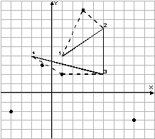

# The dog task

Time Limit: 1000MS

Memory Limit: 10000K

Special Judge


## Description

Hunter Bob often walks with his dog Ralph. Bob walks with a constant speed and his route is a polygonal line (possibly self-intersecting) whose vertices are specified by N pairs of integers (Xi, Yi) ? their Cartesian coordinates.

Ralph walks on his own way but always meets his master at the specified N points. The dog starts his journey simultaneously with Bob at the point (X1, Y1) and finishes it also simultaneously with Bob at the point (XN, YN).

Ralph can travel at a speed that is up to two times greater than his master's speed. While Bob travels in a straight line from one point to another the cheerful dog seeks trees, bushes, hummocks and all other kinds of interesting places of the local landscape which are specified by M pairs of integers (Xj',Yj'). However, after leaving his master at the point (Xi, Yi) (where 1 <= i < N) the dog visits at most one interesting place before meeting his master again at the point (Xi+1, Yi+1).

Your task is to find the dog's route, which meets the above requirements and allows him to visit the maximal possible number of interesting places. The answer should be presented as a polygonal line that represents Ralph's route. The vertices of this route should be all points (Xi, Yi) and the maximal number of interesting places (Xj',Yj'). The latter should be visited (i.e. listed in the route description) at most once.

An example of Bob's route (solid line), a set of interesting places (dots) and one of the best Ralph's routes (dotted line) are presented in the following picture:




## Input

The first line of the input contains two integers N and M, separated by a space ( 2 <= N <= 100 ,0 <= M <=100 ). The second line contains N pairs of integers X1, Y1, ..., XN, YN, separated by spaces, that represent Bob's route. The third line contains M pairs of integers X1',Y1',...,XM',YM', separated by spaces, that represent interesting places.

All points in the input file are different and their coordinates are integers not greater than 1000 by the absolute value.


## Output

The first line of the output should contain the single integer K ? the number of vertices of the best dog's route. The second line should contain K pairs of coordinates X1'',Y1'' , ...,Xk'',Yk'', separated by spaces, that represent this route. If there are several such routes, then you may write any of them.


## Sample Input

```
4 5
1 4 5 7 5 2 -2 4
-4 -2 3 9 1 2 -1 3 8 -3
```


## Sample Output

```
6
1 4 3 9 5 7 5 2 1 2 -2 4
```

## Source

Northeastern Europe 1998
