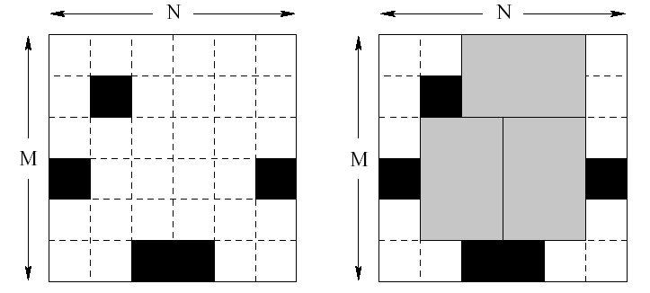

# Bugs Integrated, Inc.

Time Limit: 15000MS

Memory Limit: 30000K

Case Time Limit: 5000MS


## Description

Bugs Integrated, Inc. is a major manufacturer of advanced memory chips. They are launching production of a new six terabyte Q-RAM chip. Each chip consists of six unit squares arranged in a form of a 2*3 rectangle. The way Q-RAM chips are made is such that one takes a rectangular plate of silicon divided into N*M unit squares. Then all squares are tested carefully and the bad ones are marked with a black marker.



Finally, the plate of silicon is cut into memory chips. Each chip consists of 2*3 (or 3*2) unit squares. Of course, no chip can contain any bad (marked) squares. It might not be possible to cut the plate so that every good unit square is a part of some memory chip. The corporation wants to waste as little good squares as possible. Therefore they would like to know how to cut the plate to make the maximum number of chips possible.

Task

You are given the dimensions of several silicon plates and a list of all bad unit squares for each plate. Your task is to write a program that computes for each plate the maximum number of chips that can be cut out of the plate.


## Input

The first line of the input file consists of a single integer D (1 <= D <= 5), denoting the number of silicon plates. D blocks follow, each describing one silicon plate. The first line of each block contains three integers N (1 <= N <= 150), M (1 <= M <= 10), K (0 <= K <= MN) separated by single spaces. N is the length of the plate, M is its height and K is the number of bad squares in the plate. The following K lines contain a list of bad squares. Each line consists of two integers x and y (1 <= x <= N, 1 <= y <= M) ?coordinates of one bad square (the upper left square has coordinates [1, 1], the bottom right is [N,M]).


## Output

For each plate in the input file output a single line containing the maximum number of memory chips that can be cut out of the plate.


## Sample Input

```
2
6 6 5
1 4
4 6
2 2
3 6
6 4
6 5 4
3 3
6 1
6 2
6 4
```


## Sample Output

```
3
4
```


## Source

CEOI 2002
