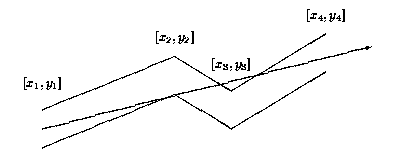

# Pipe

Time Limit: 1000MS

Memory Limit: 10000K


## Description

The GX Light Pipeline Company started to prepare bent pipes for the new transgalactic light pipeline. During the design phase of the new pipe shape the company ran into the problem of determining how far the light can reach inside each component of the pipe. Note that the material which the pipe is made from is not transparent and not light reflecting.



Each pipe component consists of many straight pipes connected tightly together. For the programming purposes, the company developed the description of each component as a sequence of points [x1; y1], [x2; y2], . . ., [xn; yn], where x1 < x2 < . . . xn . These are the upper points of the pipe contour. The bottom points of the pipe contour consist of points with y-coordinate decreased by 1. To each upper point [xi; yi] there is a corresponding bottom point [xi; (yi)-1] (see picture above). The company wants to find, for each pipe component, the point with maximal x-coordinate that the light will reach. The light is emitted by a segment source with endpoints [x1; (y1)-1] and [x1; y1] (endpoints are emitting light too). Assume that the light is not bent at the pipe bent points and the bent points do not stop the light beam.


## Input

The input file contains several blocks each describing one pipe component. Each block starts with the number of bent points 2 <= n <= 20 on separate line. Each of the next n lines contains a pair of real values xi, yi separated by space. The last block is denoted with n = 0.


## Output

The output file contains lines corresponding to blocks in input file. To each block in the input file there is one line in the output file. Each such line contains either a real value, written with precision of two decimal places, or the message Through all the pipe.. The real value is the desired maximal x-coordinate of the point where the light can reach from the source for corresponding pipe component. If this value equals to xn, then the message Through all the pipe. will appear in the output file.


## Sample Input

```
4
0 1
2 2
4 1
6 4
6
0 1
2 -0.6
5 -4.45
7 -5.57
12 -10.8
17 -16.55
0
```


## Sample Output

```
4.67
Through all the pipe.
```


## Source

Central Europe 1995
