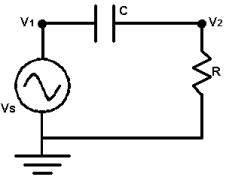

# Bode Plot

Time Limit: 1000MS

Memory Limit: 10000K


## Description

Consider the AC circuit below. We will assume that the circuit is in steady-state. Thus, the voltage at nodes 1 and 2 are given by v1 = VS coswt and v2 = VRcos (wt + q ) where VS is the voltage of the source, w is the frequency (in radians per second), and t is time. VR is the magnitude of the voltage drop across the resistor, and q is its phase.



You are to write a program to determine VR for different values of w. You will need two laws of electricity to solve this problem. The first is Ohm's Law, which states v2 = iR where i is the current in the circuit, oriented clockwise. The second is i = C d/dt (v1-v2) which relates the current to the voltage on either side of the capacitor. "d/dt"indicates the derivative with respect to t.


## Input

The input will consist of one or more lines. The first line contains three real numbers and a non-negative integer. The real numbers are VS, R, and C, in that order. The integer, n, is the number of test cases. The following n lines of the input will have one real number per line. Each of these numbers is the angular frequency, w.


## Output

For each angular frequency in the input you are to output its corresponding VR on a single line. Each VR value output should be rounded to three digits after the decimal point.


## Sample Input

```
1.0 1.0 1.0 9
0.01
0.031623
0.1
0.31623
1.0
3.1623
10.0
31.623
100.0
```


## Sample Output

```
0.010
0.032
0.100
0.302
0.707
0.953
0.995
1.000
1.000
```


## Source

Greater New York 2001
