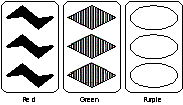
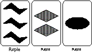

# Set Me

Time Limit: 1000MS

Memory Limit: 10000K

Special Judge


## Description

The game of Set is played with a deck of eighty-one cards, each having the following four characteristics:

.   Symbol: diamonds, ovals, or squiggles

.   Count: 1, 2, or 3 symbols

.   Color: red, green, or purple

.   Shading: outlined, filled, or striped

The cards are shuffled and a tableau of twelve cards is laid out. Players then attempt to be the first to identify "sets" which exist in the tableau. Sets are removed as they are identified and new cards are dealt in their place. Play continues in this manner until all cards have been used. The winner is the player with the most sets.

A set is a collection of three cards in which each characteristic is either the same on all three cards or different on all three cards. For example, the cards shown below form a set.



To see how the cards above form a set, take each characteristic in turn. First, each card has different symbol: the first card has squiggles, the second diamonds, and the third ovals. Second, each card has the same count of symbols, three. Third each card has a different color, and finally, each card has a different shading. Thus, each characteristic is either the same on all three cards or different on all three cards, satisfying the requirement for a set.

Consider the following example of three cards which do not form a set.



Again, take each characteristic in turn. Each card has a different symbol, each card has a different count of symbols, and each card is the same color. So far this satisfies the requirements for a set. When the shading characteristic is considered, however, two cards are filled and one card is striped. Thus, the shading on all three cards is neither all the same nor all different, and so these cards do not form a set.


## Input

The input for this program consists of several tableaus of cards. The tableaus are listed in the input file one card per line, with a single blank line between tableaus. The end of the input is marked by the end of the file. Each card in a tableau is specified by four consecutive characters on the input line. The first identifies the type of symbol on the card, and will be either a "D", "O", or "S", for Diamond, Oval, or Squiggle, respectively. The second character will be the digit 1, 2, or 3, identifying the number of symbols on the card. The third identifes the color and will be an "R", "G", or "P" for Red, Green, or Purple, respectively. The final character identifes the shading and will be an "O", "F", or "S" for Outlined, Filled, or Striped. All characters will be in uppercase.


## Output

The output for the program is, for each tableau, a list of all possible sets which could be formed using cards in the tableau. The order in which the sets are output is not important, but your output should adhere to the format illustrated by the example below. In the event that no sets exist in a tableau, report "*** None Found ***".


## Sample Input

```
S1PS
D3PO
S2GF
O2GS
O2GF
O3PO
S2RF
S3GS
D2GS
O1GS
O1GF
S2PS

O2GF
O1PF
D2PO
D3RO
S2PO
O1GF
O1GS
D2GO
S3PF
S2GF
D2GS
S1RS
```


## Sample Output

```
CARDS:  S1PS D3PO S2GF O2GS O2GF O3PO S2RF S3GS D2GS O1GS O1GF S2PS
SETS:   1.  D3PO S2RF O1GS
        2.  S3GS D2GS O1GS

CARDS:  O2GF O1PF D2PO D3RO S2PO O1GF O1GS D2GO S3PF S2GF D2GS S1RS
SETS:   *** None Found ***
```


## Source

Greater New York 2001
