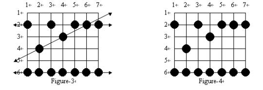

# The Troublesome Frog

Time Limit: 5000MS

Memory Limit: 100000K

Case Time Limit: 500MS


## Description

In Korea, the naughtiness of the cheonggaeguri, a small frog, is legendary. This is a well-deserved reputation, because the frogs jump through your rice paddy at night, flattening rice plants. In the morning, after noting which plants have been flattened, you want to identify the path of the frog which did the most damage. A frog always jumps through the paddy in a straight line, with every hop the same length:


Your rice paddy has plants arranged on the intersection points of a grid as shown in Figure-1, and the troublesome frogs hop completely through your paddy, starting outside the paddy on one side and ending outside the paddy on the other side as shown in Figure-2:


Many frogs can jump through the paddy, hopping from rice plant to rice plant. Every hop lands on a plant and flattens it, as in Figure-3. Note that some plants may be landed on by more than one frog during the night. Of course, you can not see the lines showing the paths of the frogs or any of their hops outside of your paddy ?for the situation in Figure-3, what you can see is shown in Figure-4:



From Figure-4, you can reconstruct all the possible paths which the frogs may have followed across your paddy. You are only interested in frogs which have landed on at least 3 of your rice plants in their voyage through the paddy. Such a path is said to be a frog path. In this case, that means that the three paths shown in Figure-3 are frog paths (there are also other possible frog paths). The vertical path down column 1 might have been a frog path with hop length 4 except there are only 2 plants flattened so we are not interested; and the diagonal path including the plants on row 2 col. 3, row 3 col. 4, and row 6 col. 7 has three flat plants but there is no regular hop length which could have spaced the hops in this way while still landing on at least 3 plants, and hence it is not a frog path. Note also that along the line a frog path follows there may be additional flattened plants which do not need to be landed on by that path (see the plant at (2, 6) on the horizontal path across row 2 in Figure-4), and in fact some flattened plants may not be explained by any frog path at all.

Your task is to write a program to determine the maximum number of landings in any single frog path (where the maximum is taken over all possible frog paths). In Figure-4 the answer is 7, obtained from the frog path across row 6.


## Input

Your program is to read from standard input. The first line contains two integers R and C, respectively the number of rows and columns in your rice paddy, 1 <= R,C <= 5000. The second line contains the single integer N, the number of flattened rice plants, 3 <= N <= 5000. Each of the remaining N lines contains two integers, the row number (1 <= row number <= R) and the column number (1 <= column number <= C) of a flattened rice plant, separated by one blank. Each flattened plant is only listed once.


## Output

Your program is to write to standard output. The output contains one line with a single integer, the number of plants flattened along a frog path which did the most damage if there exists at least one frog path, otherwise, 0.


## Sample Input

```
6 7
14
2 1
6 6
4 2
2 5
2 6
2 7
3 4
6 1
6 2
2 3
6 3
6 4
6 5
6 7
```


## Sample Output

```
7
```


## Source

IOI 2002
