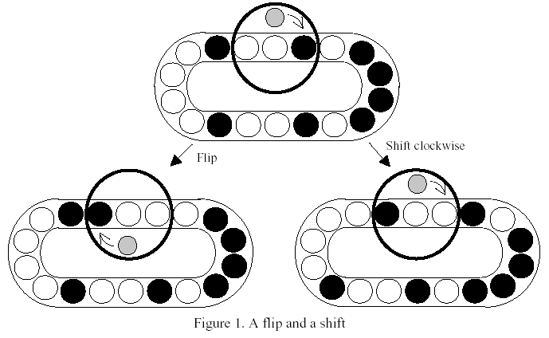
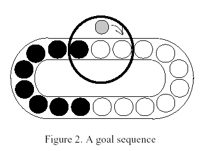

# Flip and Shift

Time Limit: 1000MS

Memory Limit: 10000K


## Description

This puzzle consists of a random sequence of m black disks and n white disks on an oval-shaped track, with a turnstile capable of flipping (i.e., reversing) three consecutive disks. In Figure 1, there are 8 black disks and 10 white disks on the track. You may spin the turnstile to flip the three disks in it or shift one position clockwise for each of the disks on the track (Figure 1).



The goal of this puzzle is to gather the disks of the same color in adjacent positions using flips and shifts. (Figure 2)



You are to write a program which decides whether a given sequence can reach a goal or not. If a goal is reachable, then write a message "YES"; otherwise, write a message "NO".


## Input

The input consists of T test cases. The number of test cases ) (T is given in the first line of the input file. Each of the next T lines gives a test case. A test case consists of an integer, representing the sum of m and n, and a sequence of m+n 0s and 1s, representing an initial sequence. A 0 denotes a white disk and a 1 denotes a black disk. The sum of m and n is at least 10 and does not exceed 30. There is a space between numbers.


## Output

The output should print either "YES" or "NO" for each test case, one per line.


## Sample Input

```
2
18 0 0 1 0 1 1 1 1 0 1 0 0 1 0 0 0 0 1
14 1 1 0 0 1 1 1 0 0 1 1 0 1 0
```


## Sample Output

```
YES
NO
```


## Source

Taejon 2001
