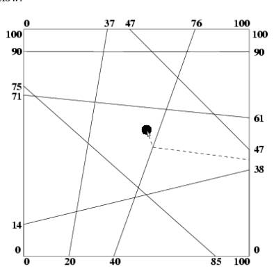

# Treasure Hunt

Time Limit: 1000MS

Memory Limit: 10000K


## Description

Archeologists from the Antiquities and Curios Museum (ACM) have flown to Egypt to examine the great pyramid of Key-Ops. Using state-of-the-art technology they are able to determine that the lower floor of the pyramid is constructed from a series of straightline walls, which intersect to form numerous enclosed chambers. Currently, no doors exist to allow access to any chamber. This state-of-the-art technology has also pinpointed the location of the treasure room. What these dedicated (and greedy) archeologists want to do is blast doors through the walls to get to the treasure room. However, to minimize the damage to the artwork in the intervening chambers (and stay under their government grant for dynamite) they want to blast through the minimum number of doors. For structural integrity purposes, doors should only be blasted at the midpoint of the wall of the room being entered. You are to write a program which determines this minimum number of doors.

An example is shown below:




## Input

The input will consist of one case. The first line will be an integer n (0 <= n <= 30) specifying number of interior walls, followed by n lines containing integer endpoints of each wall x1 y1 x2 y2 . The 4 enclosing walls of the pyramid have fixed endpoints at (0,0); (0,100); (100,100) and (100,0) and are not included in the list of walls. The interior walls always span from one exterior wall to another exterior wall and are arranged such that no more than two walls intersect at any point. You may assume that no two given walls coincide. After the listing of the interior walls there will be one final line containing the floating point coordinates of the treasure in the treasure room (guaranteed not to lie on a wall).


## Output

Print a single line listing the minimum number of doors which need to be created, in the format shown below.


## Sample Input

```
7
20 0 37 100
40 0 76 100
85 0 0 75
100 90 0 90
0 71 100 61
0 14 100 38
100 47 47 100
54.5 55.4
```


## Sample Output

```
Number of doors = 2
```


## Source

East Central North America 1999
