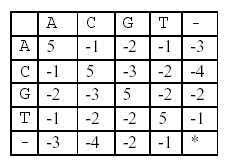

# Human Gene Functions

Time Limit: 1000MS

Memory Limit: 10000K


## Description

It is well known that a human gene can be considered as a sequence, consisting of four nucleotides, which are simply denoted by four letters, A, C, G, and T. Biologists have been interested in identifying human genes and determining their functions, because these can be used to diagnose human diseases and to design new drugs for them.

A human gene can be identified through a series of time-consuming biological experiments, often with the help of computer programs. Once a sequence of a gene is obtained, the next job is to determine its function.

One of the methods for biologists to use in determining the function of a new gene sequence that they have just identified is to search a database with the new gene as a query. The database to be searched stores many gene sequences and their functions – many researchers have been submitting their genes and functions to the database and the database is freely accessible through the Internet.

A database search will return a list of gene sequences from the database that are similar to the query gene.

Biologists assume that sequence similarity often implies functional similarity. So, the function of the new gene might be one of the functions that the genes from the list have. To exactly determine which one is the right one another series of biological experiments will be needed.

Your job is to make a program that compares two genes and determines their similarity as explained below. Your program may be used as a part of the database search if you can provide an efficient one.

Given two genes AGTGATG and GTTAG, how similar are they? One of the methods to measure the similarity of two genes is called alignment. In an alignment, spaces are inserted, if necessary, in appropriate positions of the genes to make them equally long and score the resulting genes according to a scoring matrix.

For example, one space is inserted into AGTGATG to result in AGTGAT-G, and three spaces are inserted into GTTAG to result in –GT--TAG. A space is denoted by a minus sign (-). The two genes are now of equal length. These two strings are aligned:

```
AGTGAT-G
-GT--TAG
```

In this alignment, there are four matches, namely, G in the second position, T in the third, T in the sixth, and G in the eighth. Each pair of aligned characters is assigned a score according to the following scoring matrix.



denotes that a space-space match is not allowed. The score of the alignment above is (-3)+5+5+(-2)+(-3)+5+(-3)+5=9.

Of course, many other alignments are possible. One is shown below (a different number of spaces are inserted into different positions):

```
AGTGATG
-GTTA-G
```

This alignment gives a score of (-3)+5+5+(-2)+5+(-1) +5=14. So, this one is better than the previous one. As a matter of fact, this one is optimal since no other alignment can have a higher score. So, it is said that the similarity of the two genes is 14.


## Input

The input consists of T test cases. The number of test cases ) (T is given in the first line of the input file. Each test case consists of two lines: each line contains an integer, the length of a gene, followed by a gene sequence. The length of each gene sequence is at least one and does not exceed 100.


## Output

The output should print the similarity of each test case, one per line.


## Sample Input

```
2
7 AGTGATG
5 GTTAG
7 AGCTATT
9 AGCTTTAAA
```


## Sample Output

```
14
21
```


## Source

Taejon 2001
