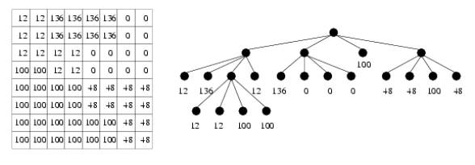

# Unscrambling Images

Time Limit: 1000MS

Memory Limit: 10000K


## Description

Quadtrees are commonly used for encoding digital images in a compact form. Given an n * n image (where n is a power of 2, 1 <= n <= 16), its quadtree encoding is computed as follows. Start with a quadtree with exactly one node, namely the root, and associate with this node the n * n square region for the entire image. Then the following is performed recursively: 

1. If every pixel in the region associated with the current node has an intensity value of p, then the node is made a leaf and it is assigned an associated value of p. 

2. Otherwise, four nodes are added as children of the current node. The region is divided into four equal (square) quadrants and each quadrant is assigned to one child node. The algorithm recurses on each of the children nodes. 

When the process terminates, we obtain a quadtree in which every internal node has four children. Every leaf node has an associated value representing the intensity of the region corresponding to the leaf node. An example of an image and its quadtree encoding is shown below. 



We have assumed that the four children represent, from left to right, the upper left, upper right, lower left, and lower right quadrants, respectively. 

To easily identify a node in a quadtree, we assign a number to each node by the following rules: 

1. The root is numbered 0. 

2. If the number of a node is k, then its children, from left to right, are numbered 4k+1; 4k+2; 4k+3; 4k +4. 

Images encoded as quadtrees can be encrypted by a secret password as follows: whenever a subdivision is performed, the four branches are reordered. The reordering may be different at each node, but it is completely determined by the password and the node number. 

Unfortunately, some people use the "save password" feature in the encoding program and use the same password for multiple images. By observing the encoding of a well-chosen test image, any image encoded with the same password can be decoded without the password. In this test image, each pixel has a distinct intensity from 0 to n^2-1 arranged from left-to-right, top-to-bottom in increasing order. An example for n = 16 is given below: 


You managed to gain access to the encoding program and used it to encode the test image. Given the quadtree encoding of the test image, write a program to decode any other image encoded with the same password.


## Input

You will be given a number of cases in the input. The first line of input consists of a positive integer indicating the number of test cases to follow. Each test case starts with a line containing n, followed by the quadtree encoding of the test image and the quadtree encoding of the secret image to be decoded. Each quadtree encoding starts with a line containing a positive integer m indicating the number of leaf nodes in the tree. The next m lines are of the form: 

k intensity

which specifies that the node numbered k is a leaf node with the specified intensity as the associated leaf value. Nodes not specified are either internal nodes or absent in the quadtree. You may assume that all intensities are between 0 and 255, inclusively. You may also assume that each quadtree encoding is a valid output obtained from the encoding lgorithm described above.


## Output

For each test case, print the case number followed by a blank line. Then, print the intensities of the pixels of the decoded image one row at a time. Print each intensity right-justified in a field of width 4, with no extra spaces between fields. Insert a blank line between cases.


## Sample Input

```
2
2
4
1 3
2 2
3 0
4 1
4
1 23
2 123
3 253
4 40
4
16
5 8
6 9
7 13
8 12
9 0
10 4
11 1
12 5
13 2
14 3
15 7
16 6
17 10
18 11
19 15
20 14
7
2 10
3 20
4 30
5 41
6 42
7 44
8 43
```


## Sample Output

```
Case 1 

 253  40 
 123  23 

Case 2 

  10  10  20  20 
  10  10  20  20 
  41  42  30  30 
  43  44  30  30
```


## Source

East Central North America 1999
