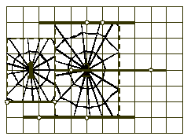

# Library

Time Limit: 1000MS

Memory Limit: 10000K


## Description

Castaway Robinson Crusoe is living alone on a remote island. One day a ship carrying a royal library has wrecked nearby. Usually Robinson brings any useful stuff from the shipwreck to his island, and this time he has brought a big chest with books.

Robinson has decided to build a bookcase for these books to create his own library. He cut a rectangular niche in the rock for that purpose, hammered in wooden pegs, and placed wooden planks on every pair of pegs that have the same height, so that all planks are situated horizontally and suit to act as shelves.

Unfortunately, Robinson has discovered that one especially old and big tome does not fit in his bookcase. He measured the height and width of this tome and has decided to redesign his bookcase in such a way, as to completely fit the tome on one of the shelves, taking into account locations of other shelves and the dimensions of the niche. With each shelf in the bookcase, one of the following operations should be made:



1. Leave the shelf on its original place.

2. Move the shelf to the left or to the right.

3. Shorten the shelf by cutting off a part of the plank and optionally move it to the left or to the right.

4. Move one of the pegs to a different place at the same height and move the shelf to the left or to the right.

5. Shorten the shelf by cutting off a part of the plank, move one of the pegs to a different place at the same height, and optionally move the shortened shelf to the left or to the right.

6. Remove the shelf from the bookcase along with both supporting pegs.

We say that the shelf is properly supported by its pegs, if exactly two distinct pegs support the shelf and the center of the shelf is between its pegs or coincides with one of the pegs. The original design of Robinson's library has all the shelves properly supported by their pegs and lengths of all shelves are integer number of inches. The Robinson may only cut an integer number of inches from the planks, because he has no tools for more precise measurements. All remaining shelves after the redesign must be properly supported by their pegs.

You are to find the way to redesign Robinson's library to fit the special old tome without changing original design too much. You have to minimize the number of pegs that are to be removed from their original places during the redesign (operations 4 and 5 remove one peg, and operation 6 removes two pegs). If there are different ways to solve the problem, then you are to find the one that minimizes the total length of planks that are to be cut off (operations 3 and 5 involve cutting something from the planks, and operation 6 counts as if cutting off the whole plank). Width of planks and diameter of pegs shall be considered zero.

The tome may not be rotated. The tome should completely (to all its width) stand on one of the shelves and may only touch other shelves, their pegs or niche's edge.


## Input

The first line of the input file contains four integer numbers XN, YN, XT, and YT, separated by spaces. They are, correspondingly, width and height of the niche, and width and height of the old tome in inches (1 <= XN, YN, XT, YT <= 1000).

The second line of the input file contains a single integer number N (1 <= N <= 100) that represents the number of the shelves. Then N lines follow. Each line represents a single shelf along with its two supporting pegs, and contains five integer numbers yi, xi, li, x1i, x2i, separated by spaces, where:

- yi (0 < yi < YN) - the height of the ith shelf above the bottom of the niche in inches.

- xi (0 <= xi < XN) - the distance between the left end of the ith shelf and the left edge of the niche in inches.

- li (0 < li <= XN - xi) - the length of the ith shelf in inches.

- x1i (0 <= x1i <= li/2) - the distance between the left end of the ith shelf and its leftmost supporting peg in inches.

- x2i (li/2 <= x2i <= li; x1i < x2i) - the distance between the left end of the ith shelf and its rightmost supporting peg in inches.

All shelves are situated on different heights and are properly supported by their pegs. The problem is guaranteed to have a solution for the input data.


## Output

The output file shall contain two integer numbers separated by a space. The first one is the minimal number of pegs that are to be removed by Robinson from their original locations to place the tome. The second one is the minimal total length of planks in inches that are to be cut off during the redesign that removes the least number of pegs.


## Sample Input

```
11 8 4 6
4
1 1 7 1 4
4 3 7 1 6
7 2 6 3 4
2 0 3 0 3
```


## Sample Output

```
1 3
```


## Source

Northeastern Europe 2001
