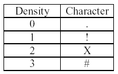

# A New Growth Industry

Time Limit: 1000MS

Memory Limit: 10000K


## Description

A biologist experimenting with DNA modification of bacteria has found a way to make bacterial colonies sensitive to the surrounding population density. By changing the DNA, he is able to "program"the bacteria to respond to the varying densities in their immediate neighborhood.

The culture dish is a square, divided into 400 smaller squares (20x20). Population in each small square is measured on a four point scale (from 0 to 3). The DNA information is represented as an array D, indexed from 0 to 15, of integer values and is interpreted as follows:

In any given culture dish square, let K be the sum of that square's density and the densities of the four squares immediately to the left, right, above and below that square (squares outside the dish are considered to have density 0). Then, by the next day, that dish square's density will change by D[K] (which may be a positive, negative, or zero value). The total density cannot, however, exceed 3 nor drop below 0.

Now, clearly, some DNA programs cause all the bacteria to die off (e.g., [-3, -3, ..., -3]). Others result in immediate population explosions (e.g., [3,3,3, ..., 3]), and others are just plain boring (e.g., [0, 0,...,0]). The biologist is interested in how some of the less obvious DNA programs might behave.

Write a program to simulate the culture growth, reading in the number of days to be simulated, the DNA rules, and the initial population densities of the dish.


## Input

Input to this program consists of three parts:

1. The first line will contain a single integer denoting the number of days to be simulated.

2. The second line will contain the DNA rule D as 16 integer values, ordered from D[0] to D[15], separated from one another by one or more blanks. Each integer will be in the range -3...3, inclusive.

3. The remaining twenty lines of input will describe the initial population density in the culture dish. Each line describes one row of squares in the culture dish, and will contain 20 integers in the range 0?, separated from one another by 1 or more blanks


## Output

The program will produce exactly 20 lines of output, describing the population densities in the culture dish at the end of the simulation. Each line represents a row of squares in the culture dish, and will consist of 20 characters, plus the usual end-of-line terminator.

Each character will represent the population density at a single dish square, as follows:



No other characters may appear in the output.


## Sample Input

```
2
0 1 1 1 2 1 0 -1 -1 -1 -2 -2 -3 -3 -3 -3
3 0 0 0 0 0 0 0 0 0 0 0 0 0 0 0 0 0 0 0
0 0 0 0 0 0 0 0 0 0 0 0 0 0 0 0 0 0 0 0
0 0 0 0 0 0 0 0 0 0 0 0 0 0 0 0 0 0 0 0
0 0 0 0 0 0 0 0 0 0 0 0 0 0 0 0 0 0 0 0
0 0 0 0 0 0 0 0 0 0 0 0 0 0 0 0 0 0 0 0
0 0 0 0 0 0 0 0 0 0 0 0 0 0 0 0 0 0 0 0
0 0 0 0 0 0 0 0 0 0 0 0 0 0 0 0 0 0 0 0
0 0 0 0 0 0 0 0 0 0 0 0 0 0 0 0 0 0 0 0
0 0 0 0 0 0 0 0 0 0 0 0 0 0 0 0 0 0 0 0
0 0 0 0 0 0 0 0 0 3 0 0 0 0 0 0 0 0 0 0
0 0 0 0 0 0 0 0 0 0 0 0 0 0 0 0 0 0 0 0
0 0 0 0 0 0 0 0 0 0 0 0 0 0 0 0 0 0 0 0
0 0 0 0 0 0 0 0 0 0 0 0 0 0 0 0 0 0 0 0
0 0 0 0 0 0 0 0 0 0 0 0 0 0 0 0 0 0 0 0
0 0 0 0 0 0 0 0 0 0 0 0 0 0 0 0 0 0 0 0
0 0 0 0 0 0 0 0 0 0 0 0 0 0 0 0 0 0 0 0
0 0 0 0 0 0 0 0 0 0 0 0 0 0 0 0 0 0 0 0
0 0 0 0 0 0 0 0 0 0 0 0 0 0 0 0 0 0 0 0
0 0 0 0 0 0 0 0 0 0 0 0 0 0 0 0 0 0 0 0
0 0 0 0 0 0 0 0 0 0 0 0 0 0 0 0 0 0 0 0
```


## Sample Output

```
##!.................
#!..................
!...................
....................
....................
....................
....................
.........!..........
........!#!.........
.......!#X#!........
........!#!.........
.........!..........
....................
....................
....................
....................
....................
....................
....................
....................
```


## Source

Mid-Atlantic 2001
