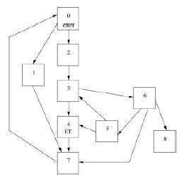

# Alien Security

Time Limit: 1000MS

Memory Limit: 10000K


## Description

You are in charge of security at a top-secret government research facility. Recently your government has captured a live extra-terrestrial (ET) life form, and is hosting an open day for fellow researchers. Of course, not all the guests can be trusted, so they are assigned different security clearance levels. Only guests with a level 5 rating will be allowed into the lab where the extra-terrestrial is being held; other than that, everyone is free to roam throughout the rest of the facility. Each room in the facility is connected via one-way airlocks, so that you can pass through the door in only one direction.

To protect your precious ET you will put in place enhanced security measures (in the form of armed guards) on the route leading to the room containing the ET, but not in the room itself ?the guards do not have sufficient clearance to enter the room containing the ET.

The guards will check the identity and the security rating of all guests trying to pass through the room in which they are stationed, so you would like to place the guards where they will cause the minimum amount of irritation to the guests who have no intention of visiting the ET. The room where the guards must be placed thus satisfies the following two conditions:

1. In order to get to the room containing the ET, the guests must pass through the room containing the guards;

2. There is no other room with this property that is closer to the room containing the ET ?remember, the guards cannot be placed in the room containing the ET itself.

The diagram below illustrates one possible map of your facility:



Note that placing the guards in room 2 would satisfy the first condition, but room 3 is closer to the ET, so the guards must be placed in room 3.


## Input

All guests enter through room 0, the entrance to your facility. Your program accepts a sequence of lines containing integers. The first line consists of two integers: the number of rooms, and the room in which the ET is being held (out of his own free will, of course).

The rest of the input is a sequence of lines consisting of only two integers, specifying where the airlock-doors are located. The first number on these lines specifies the source room, and the second the destination room. Remember: you can pass only from the source room to the destination room.


## Output

The output of your program consists only of a single line:

Put guards in room N.

where N is the room you've decided to place the guards.


## Sample Input

```
9 4
0 2
2 3
3 4
5 3
5 4
3 6
6 5
6 7
6 8
4 7
0 1
1 7
7 0
```


## Sample Output

```
Put guards in room 3.
```


## Source

Southern African 2001
