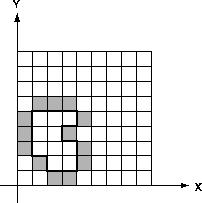

# Border

Time Limit: 1000MS

Memory Limit: 10000K


## Description

You are to write a program that draws a border around a closed path into a bitmap, as displayed in the following figure:



The path is closed and runs along the grid lines, i.e. between the squares of the grid. The path runs counter-clockwise, so if following the path is considered as going ``forward'', the border pixels are always to the "right'' of the path. The bitmap always covers 32 by 32 squares and has its lower left corner at (0, 0). You can safely assume that the path never touches the bounding rectangle of the bitmap and never touches or crosses itself. Note that a bit gets set if it is on the outside of the area surrounded by the path and if at least one of its edges belongs to the path, but not if only one of its corners is in the path. (A look at the convex corners in the figure should clarify that statement.)


## Input

The first line of the input file contains the number of test cases in the file. Each test case that follows consists of two lines. The first line of each case contains two integer numbers x and y specifying the starting point of the path. The second line contains a string of variable length. Every letter in the string symbolizes a move of length one along the grid. Only the letters 'W' ("west"), 'E' ("east"), 'N' ("north"), 'S' ("south"), and '.' ("end of path", no move) appear in the string. The end-of-path character ( '.') is immediately followed by the end of the line.


## Output

For each test case, output a line with the number of the case ('Bitmap #1', 'Bitmap #2', etc.). For each row of the bitmap from top to bottom, print a line where you print a character for every bit in that row from left to right. Print an uppercase 'X' for set bits and a period '.' for unset bits. Output a blank line after each bitmap.


## Sample Input

```
1
2 1
EENNWNENWWWSSSES.
```


## Sample Output

```
Bitmap #1
................................
................................
................................
................................
................................
................................
................................
................................
................................
................................
................................
................................
................................
................................
................................
................................
................................
................................
................................
................................
................................
................................
................................
................................
................................
................................
.XXX............................
X...X...........................
X..X............................
X...X...........................
.X..X...........................
..XX............................
```


## Source

Southwestern European Regional Contest 1996
