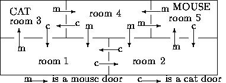

# Cat and Mouse

Time Limit: 1000MS

Memory Limit: 10000K


## Description

In a house with many rooms live a cat and a mouse. The cat and the mouse each have chosen one room as their ``home". From their ``home" they regularly walk through the house. A cat can go from room A to room B if and only if there is a cat door from room A to room B. Cat doors can only be used in one direction. Similarly a mouse can go from room A to room B if and only if there is a mouse door from room A to room B . Also mouse doors can be used in only one direction. Furthermore, cat doors cannot be used by a mouse, and mouse doors cannot be used by a cat.

Given a map of the house you are asked to write a program that finds out

1.if there exist walks for the cat and mouse where they meet each other in some room, and
2.if the mouse can make a walk through at least two rooms, end in its ``home" room again, and along the way cannot ever meet the cat. (Here, the mouse may not ever meet the cat, whatever the cat does.)



For example, in the map, the cat can meet the mouse in rooms 1, 2, and 3. Also, the mouse can make a walk through two rooms without ever meeting the cat, viz., a round trip from room 5 to 4 and back.


## Input

The input begins with a single positive integer on a line by itself indicating the number of the cases following, each of them as described below. This line is followed by a blank line, and there is also a blank line between two consecutive inputs.

The input consists of integers and defines the configuration of the house. The first line has three integers separated by blanks: the first integer defines the number of rooms, the second the initial room of the cat (the cat's ``home"), and the third integer defines the initial room of the mouse (the mouse's ``home"). Next there are zero or more lines, each with two positive integers separated by a blank. These lines are followed by a line with two -1's separated by a blank. The pairs of positive integers define the cat doors. The pair A B represents the presence of a cat door from room A to room B . Finally there are zero or more lines, each with two positive integers separated by a blank. These pairs of integers define the mouse doors. Here, the pair A B represents the presence of a mouse door from room A to room B . Also end with -1,-1.

The number of rooms is at least one and at most 100. All rooms are numbered consecutively starting at 1. You may assume that all positive integers in the input are legal room numbers.


## Output

For each test case, the output must follow the description below.

The output consists of two characters separated by a blank and ended by a new-line character. The first character is Y if there exist walks for the cat and mouse where they meet each other in some room. Otherwise, it is N. The second character is Y if the mouse can make a walk through at least two rooms, end in its ``home" room again, and along the way cannot ever meet the cat. Otherwise, it is N.


## Sample Input

```
1

5 2 4
1 2
2 1
3 1
4 3
5 2
-1 -1
1 3
2 5
3 4
4 1
4 2
4 5
5 4
-1 -1
```


## Sample Output

```
Y Y
```


## Source

East Central North America 1994
