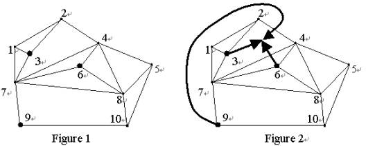

# Walls

Time Limit: 1000MS

Memory Limit: 10000K


## Description

In a country, great walls have been built in such a way that every great wall connects exactly two towns. The great walls do not cross each other. Thus, the country is divided into such regions that to move from one region to another, it is necessary to go through a town or cross a great wall. For any two towns A and B, there is at most one great wall with one end in A and the other in B, and further, it is possible to go from A to B by always walking in a town or along a great wall. The input format implies additional restrictions.

There is a club whose members live in the towns. In each town, there is only one member or there are no members at all. The members want to meet in one of the regions (outside of any town). The members travel riding their bicycles. They do not want to enter any towns, because of the traffic, and they want to cross as few great walls as possible, as it is a lot of trouble. To go to the meeting region, each member needs to cross a number (possibly 0) of great walls. They want to find such an optimal region that the sum of these numbers (crossing-sum, for short) is minimized.



The towns are labeled with integers from 1 to N, where N is the number of towns. In Figure 1, the labeled nodes represent the towns and the lines connecting the nodes represent the great walls. Suppose that there are three members, who live in towns 3, 6, and 9. Then, an optimal meeting region and respective routes for members are shown in Figure 2. The crossing-sum is 2: the member from town 9 has to cross the great wall between towns 2 and 4, and the member from town 6 has to cross the great wall between towns 4 and 7.

You are to write a program which, given the towns, the regions, and the club member home towns, computes the optimal region(s) and the minimal crossing-sum.


## Input

Your program is to read from standard input. The first line contains one integer: the number of regions M, 2 <= M <= 200. The second line contains one integer: the number of towns N, 3 <= N <= 250. The third line contains one integer: the number of club members L, 1 <= L <= 30, L <= N. The fourth line contains L distinct integers in increasing order: the labels of the towns where the members live.

After that the input contains 2M lines so that there is a pair of lines for each region: the first two of the 2M lines describe the first region, the following two the second and so on. Of the pair, the first line shows the number of towns I on the border of that region. The second line of the pair contains I integers: the labels of these I towns in some order in which they can be passed when making a trip clockwise along the border of the region, with the following exception. The last region is the "outside region" surrounding all towns and other regions, and for it the order of the labels corresponds to a trip in counterclockwise direction. The order of the regions gives an integer labeling to the regions: the first region has label 1, the second has label 2, and so on. Note that the input includes all regions formed by the towns and great walls, including the "outside region".


## Output

Your program is to write to standard output. The first line contains one integer: the minimal crossing-sum.


## Sample Input

```
10
10
3
3 6 9
3
1 2 3
3
1 3 7
4
2 4 7 3
3
4 6 7
3
4 8 6
3
6 8 7
3
4 5 8
4
7 8 10 9
3
5 10 8
7
7 9 10 5 4 2 1
```


## Sample Output

```
2
```


## Source

IOI 2000
