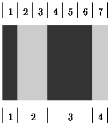

# Bar Codes

Time Limit: 1000MS

Memory Limit: 10000K


## Description

A bar-code symbol consists of alternating dark and light bars, starting with a dark bar on the left. Each bar is a number of units wide. Figure 1 shows a bar-code symbol consisting of 4 bars that extend over 1+2+3+1=7 units.



Figure 1: Bar-code symbol over 7 units (see top) with 4 bars (see bottom)

In general, the bar code BC(n,k,m) is the set of all symbols with k bars that together extend over exactly n units, each bar being at most m units wide. For instance, the symbol in Figure 1 belongs to BC(7,4,3) but not to BC(7,4,2).

```
0: 1000100  |  8: 1100100
1: 1000110  |  9: 1100110
2: 1001000  | 10: 1101000
3: 1001100  | 11: 1101100
4: 1001110  | 12: 1101110
5: 1011000  | 13: 1110010
6: 1011100  | 14: 1110100
7: 1100010  | 15: 1110110
```

Figure 2: All symbols of BC(7,4,3)

Figure 2 shows all 16 symbols in BC(7,4,3). Each `1' represents a dark unit, each `0' a light unit. The symbols appear in lexicographic (dictionary) order. The number on the left of the colon (`:') is the rank of the symbol. The symbol in Figure 1 has rank 4 in BC(7,4,3).


## Input

Your program is to read from standard input. The first line contains the numbers n, k, and m (1 <= n,k,m <= 33). On the second line is a number s (0 <= s <= 100). The following s lines each contain some symbol in BC(n,k,m), represented by '0's and '1's as in Figure 2.


## Output

Your program is to write to standard output. On the first line your program should write the total number of symbols in BC(n,k,m). On each of the s following lines, it should write the rank of the corresponding symbol in the input.


## Sample Input

```
7 4 3
5
1001110
1110110
1001100
1001110
1000100
```


## Sample Output

```
16
4
15
3
4
0
```


## Source

IOI 1995
